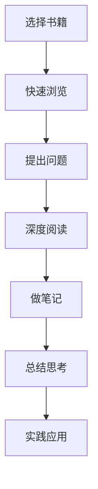

# 阅读的力量

书籍是人类进步的阶梯，阅读是心灵成长的养分。

## 为什么要阅读

阅读不仅能增长知识，更能塑造思维方式和价值观。

### 阅读的益处

1. **拓宽视野** - 了解不同的文化和思想
2. **提升思维** - 培养批判性思维能力
3. **丰富情感** - 体验不同的人生经历
4. **减压放松** - 在文字中找到心灵的慰藉

## 我的阅读清单

### 技术类

- 《代码大全》 - 软件开发的百科全书
- 《深入理解计算机系统》 - 计算机科学经典
- 《设计模式》 - 面向对象设计精髓

### 人文类

- 《活着》 - 余华
- 《百年孤独》 - 马尔克斯
- 《人类简史》 - 尤瓦尔·赫拉利

### 自我提升

- 《原则》 - 瑞·达利欧
- 《思考，快与慢》 - 丹尼尔·卡尼曼
- 《刻意练习》 - 安德斯·艾利克森

## 阅读方法

### 主动阅读法



### 阅读笔记模板

| 维度 | 内容 |
|------|------|
| 核心观点 | 书中最重要的3个观点 |
| 启发思考 | 对我的启发和思考 |
| 行动计划 | 可以立即实践的内容 |
| 金句摘录 | 值得记录的句子 |

## 阅读习惯的养成

> 每天阅读30分钟，一年可以读完20-30本书。

### 我的阅读时间

- **早晨** - 起床后阅读15分钟，开启美好一天
- **通勤** - 利用碎片时间阅读电子书
- **睡前** - 阅读30分钟，帮助入眠

### 阅读环境

创造一个舒适的阅读环境很重要：

```javascript
const perfectReadingEnvironment = {
  lighting: '柔和的暖光',
  temperature: '20-24°C',
  sound: '安静或轻音乐',
  posture: '舒适的坐姿或躺姿',
  beverage: '一杯茶或咖啡'
}
```

## 数字时代的阅读

在信息爆炸的时代，我们需要：

- **筛选信息** - 选择高质量的内容
- **深度阅读** - 避免浅层次的碎片化阅读
- **独立思考** - 不被信息流裹挟
- **知行合一** - 将阅读所得应用到生活中

> **思考**: 你上一次完整读完一本书是什么时候？今天就开始吧！
