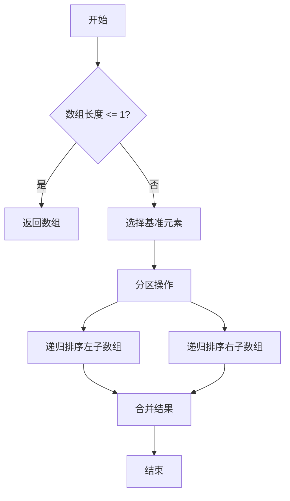
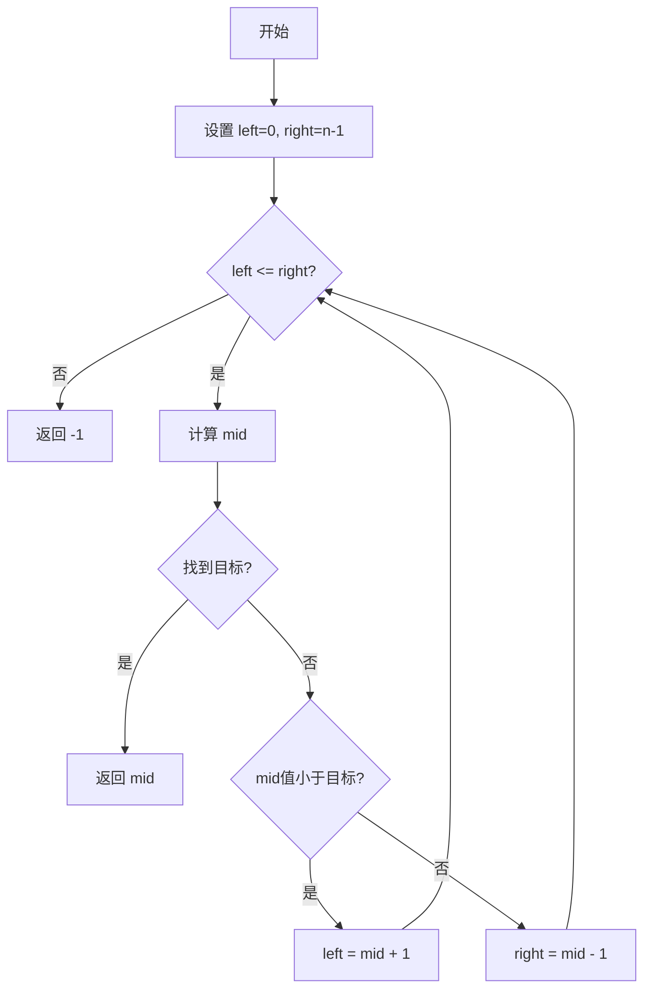
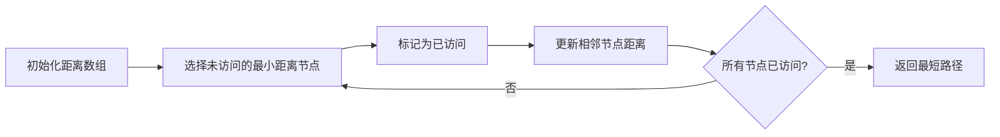

# 算法与数学公式详解

本文通过数学公式和流程图详细讲解常见算法的原理。

## 时间复杂度

### 常见复杂度

| 复杂度 | 名称 | 示例 |
|--------|------|------|
| $O(1)$ | 常数 | 数组访问 |
| $O(\log n)$ | 对数 | 二分查找 |
| $O(n)$ | 线性 | 遍历数组 |
| $O(n \log n)$ | 线性对数 | 快速排序 |
| $O(n^2)$ | 平方 | 冒泡排序 |

### 大O表示法

时间复杂度的数学定义：

$$
T(n) = O(f(n)) \iff \exists c > 0, n_0 > 0, \forall n \geq n_0: T(n) \leq c \cdot f(n)
$$

## 快速排序

### 算法流程



### 代码实现

```javascript
function quickSort(arr) {
  if (arr.length <= 1) return arr

  const pivot = arr[Math.floor(arr.length / 2)]
  const left = arr.filter(x => x < pivot)
  const middle = arr.filter(x => x === pivot)
  const right = arr.filter(x => x > pivot)

  return [...quickSort(left), ...middle, ...quickSort(right)]
}
```

### 平均时间复杂度推导

快速排序的平均时间复杂度：

$$
T(n) = T(k) + T(n-k-1) + \Theta(n)
$$

其中 $k$ 是分区后左侧元素个数。平均情况下：

$$
T(n) = 2T(n/2) + \Theta(n) = \Theta(n \log n)
$$

## 动态规划

### 斐波那契数列

递推公式：

$$
F(n) = \begin{cases}
0 & n = 0 \\
1 & n = 1 \\
F(n-1) + F(n-2) & n \geq 2
\end{cases}
$$

通项公式（Binet公式）：

$$
F(n) = \frac{1}{\sqrt{5}} \left[ \left(\frac{1+\sqrt{5}}{2}\right)^n - \left(\frac{1-\sqrt{5}}{2}\right)^n \right]
$$

### 代码实现

```javascript
// 动态规划实现
function fibonacci(n) {
  if (n <= 1) return n

  const dp = [0, 1]
  for (let i = 2; i <= n; i++) {
    dp[i] = dp[i-1] + dp[i-2]
  }
  return dp[n]
}

// 空间优化版本
function fibonacciOptimized(n) {
  if (n <= 1) return n

  let prev = 0, curr = 1
  for (let i = 2; i <= n; i++) {
    [prev, curr] = [curr, prev + curr]
  }
  return curr
}
```

## 二分查找

### 算法流程图



### 代码实现

```javascript
function binarySearch(arr, target) {
  let left = 0
  let right = arr.length - 1

  while (left <= right) {
    const mid = Math.floor((left + right) / 2)

    if (arr[mid] === target) {
      return mid
    } else if (arr[mid] < target) {
      left = mid + 1
    } else {
      right = mid - 1
    }
  }

  return -1
}
```

### 时间复杂度分析

每次迭代将搜索空间减半：

$$
T(n) = T(n/2) + O(1)
$$

根据主定理：

$$
T(n) = O(\log n)
$$

## 最短路径算法

### Dijkstra 算法流程



### 距离更新公式

对于边 $(u, v)$，更新距离：

$$
dist[v] = \min(dist[v], dist[u] + weight(u, v))
$$

## 概率与期望

### 随机算法期望时间

对于随机快速排序，期望比较次数：

$$
E[X] = \sum_{i=1}^{n-1} \sum_{j=i+1}^{n} \frac{2}{j-i+1} = 2n \ln n - O(n)
$$

### 哈希冲突概率

使用 $m$ 个桶存储 $n$ 个元素，冲突概率：

$$
P(\text{collision}) = 1 - \frac{m!}{m^n(m-n)!} \approx 1 - e^{-\frac{n^2}{2m}}
$$

## 总结

算法分析离不开数学工具：

- 递推关系求解时间复杂度
- 概率论分析随机算法
- 图论解决路径问题
- 动态规划优化递归计算

> **提示**: 掌握数学基础能帮助我们更深入理解算法本质。
