# Mermaid 图表完全指南

Mermaid 是一个基于 JavaScript 的图表工具，可以通过文本描述生成各种专业图表。

## 流程图 (Flowchart)

### 基础流程图

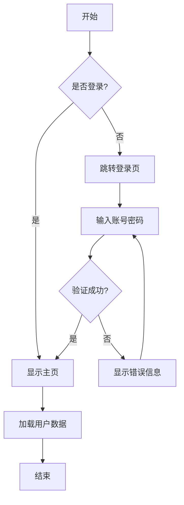

### 横向流程图

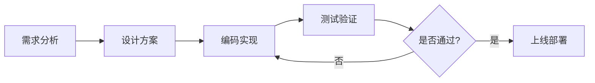

## 时序图 (Sequence Diagram)

### 用户登录时序图

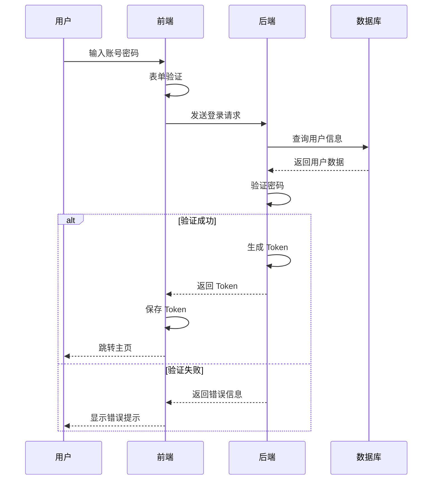

### API 调用时序图

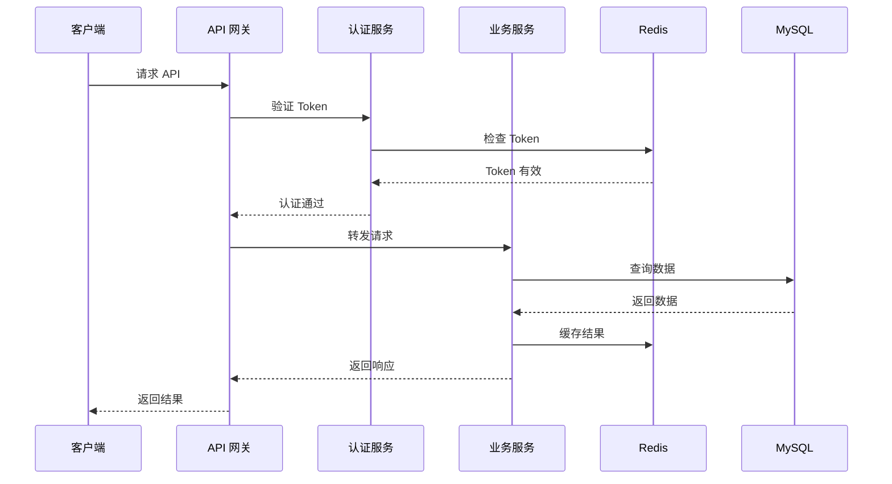

## 甘特图 (Gantt Chart)

### 项目开发计划

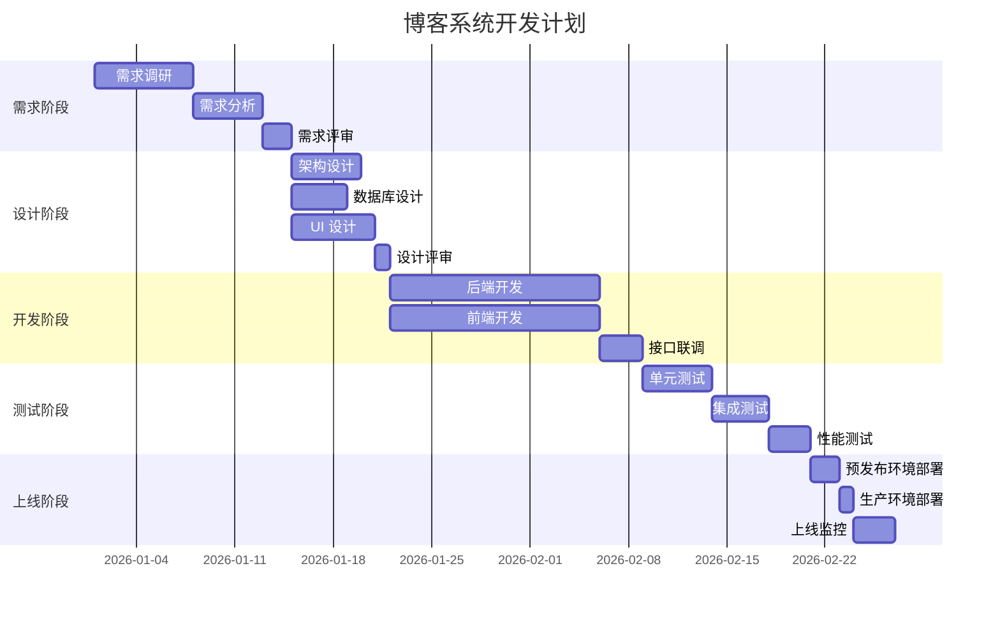

## 类图 (Class Diagram)

### 博客系统类图

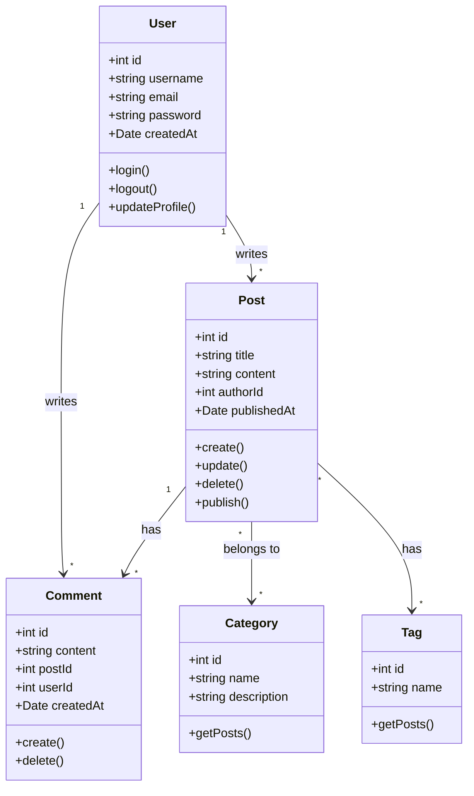

### 电商系统类图

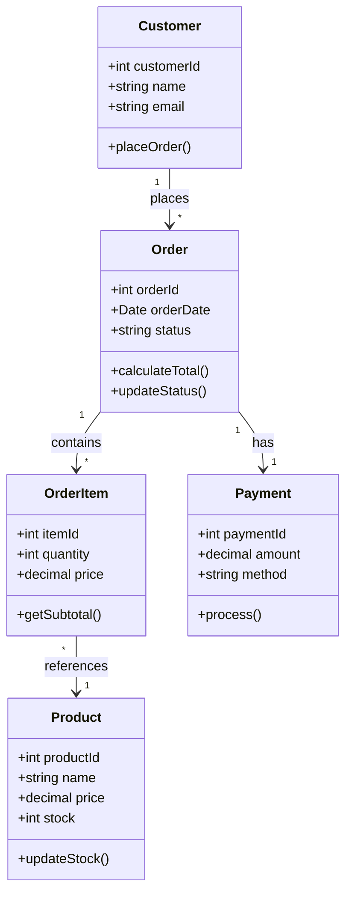

## 状态图 (State Diagram)

### 订单状态流转

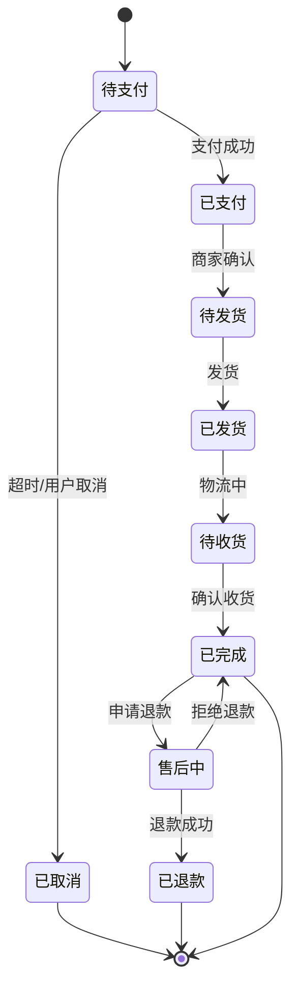

### 文章发布状态

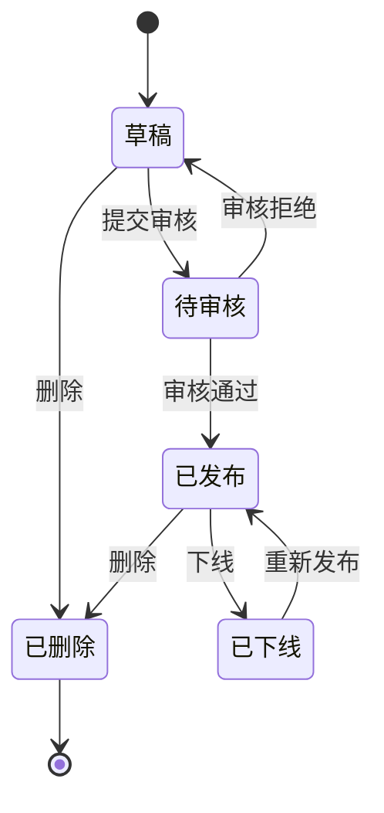

## 饼图 (Pie Chart)

### 编程语言使用占比

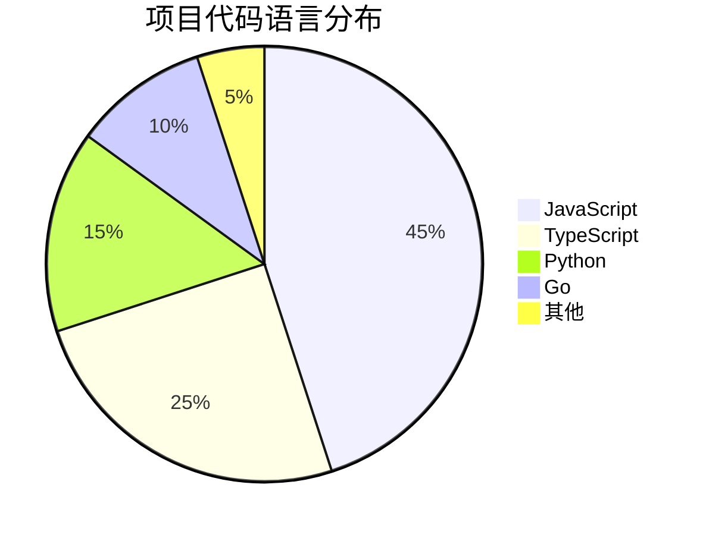

### 用户来源分析

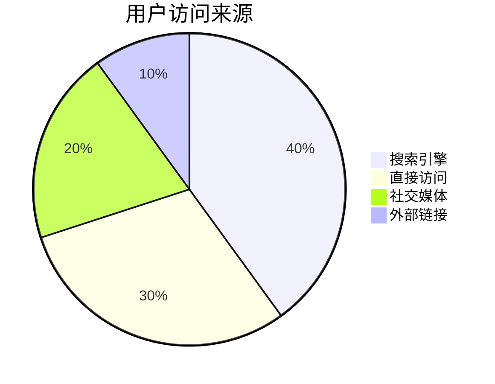

## ER 图 (Entity Relationship)

### 数据库关系图

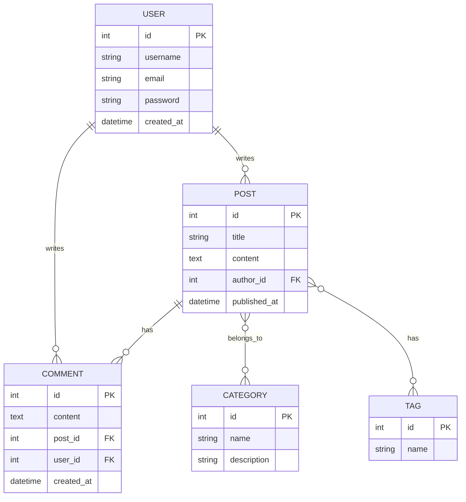

## Git 图 (Git Graph)

### 分支管理流程

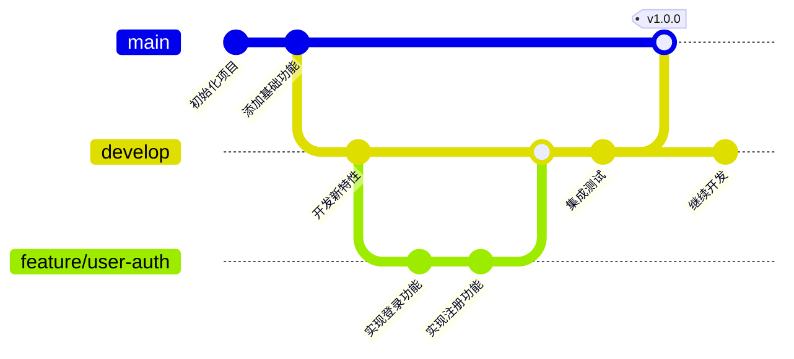

## 使用建议

### 选择合适的图表类型

| 图表类型 | 适用场景 | 复杂度 |
|---------|---------|--------|
| 流程图 | 业务流程、算法逻辑 | 低 |
| 时序图 | 系统交互、API 调用 | 中 |
| 甘特图 | 项目计划、任务安排 | 中 |
| 类图 | 系统架构、代码结构 | 高 |
| 状态图 | 状态流转、生命周期 | 中 |
| 饼图 | 数据占比、统计分析 | 低 |
| ER 图 | 数据库设计 | 中 |

### 最佳实践

1. **保持简洁**: 避免在一个图表中包含过多信息
2. **使用标准符号**: 遵循行业标准的图表符号
3. **添加说明**: 为复杂的图表添加必要的注释
4. **合理布局**: 注意节点和连线的排列，保持清晰
5. **颜色使用**: 适当使用颜色区分不同类型的元素

> **提示**: Mermaid 图表可以直接在 Markdown 中编写，无需额外的绘图工具，非常适合技术文档编写。
