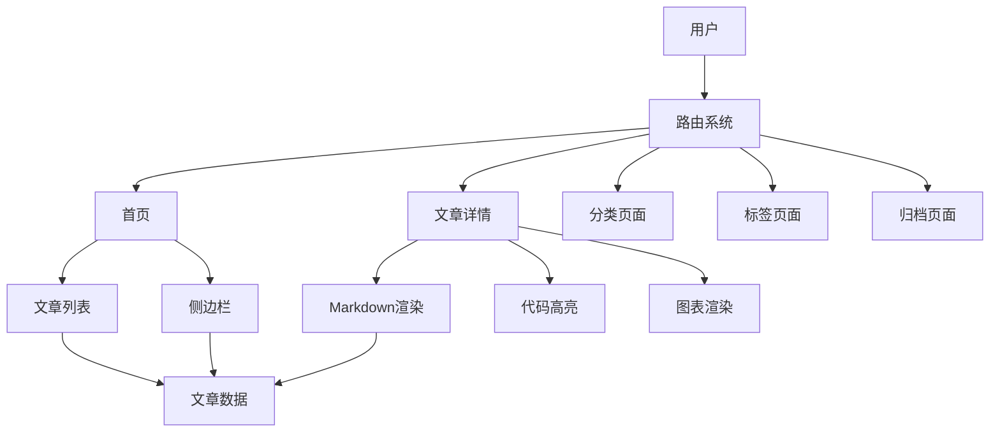

# 个人博客系统开发实战

本文记录了从零开始构建一个现代化博客系统的完整过程。

## 技术栈选择

### 前端技术

```javascript
const techStack = {
  framework: 'Vue 3',
  buildTool: 'Vite',
  markdown: 'marked.js',
  diagram: 'Mermaid',
  math: 'KaTeX',
  highlight: 'highlight.js',
  router: 'Vue Router'
}
```

### 为什么选择这些技术

| 技术 | 优势 | 适用场景 |
|------|------|----------|
| Vue 3 | 响应式、组件化 | 单页应用 |
| Vite | 快速构建、HMR | 开发体验 |
| marked.js | 轻量、可扩展 | Markdown渲染 |
| Mermaid | 图表支持 | 技术文档 |

## 系统架构

### 整体架构图



### 目录结构

```
src/
├── components/      # 组件
│   ├── Header.vue
│   ├── Footer.vue
│   └── Sidebar.vue
├── views/          # 页面
│   ├── Home.vue
│   ├── Post.vue
│   ├── Archive.vue
│   ├── Categories.vue
│   └── Tags.vue
├── utils/          # 工具函数
│   └── posts.js
├── posts/          # Markdown文章
└── main.js         # 入口文件
```

## 核心功能实现

### 1. Markdown文章解析

```javascript
// 解析frontmatter
function parseFrontmatter(markdown) {
  const frontmatterRegex = /^---\n([\s\S]*?)\n---\n([\s\S]*)$/
  const match = markdown.match(frontmatterRegex)

  if (!match) {
    return { metadata: {}, content: markdown }
  }

  const [, frontmatter, content] = match
  const metadata = {}

  frontmatter.split('\n').forEach(line => {
    const [key, ...values] = line.split(':')
    if (key && values.length) {
      const value = values.join(':').trim()
      metadata[key.trim()] = parseValue(value)
    }
  })

  return { metadata, content }
}
```

### 2. 文章列表加载

```javascript
export async function getAllPosts() {
  const postModules = import.meta.glob('/src/posts/*.md', {
    query: '?raw',
    import: 'default'
  })

  const posts = []

  for (const path in postModules) {
    const markdown = await postModules[path]()
    const { metadata, content } = parseFrontmatter(markdown)
    const id = path.split('/').pop().replace('.md', '')

    posts.push({
      id,
      ...metadata,
      content
    })
  }

  return posts.sort((a, b) => new Date(b.date) - new Date(a.date))
}
```

### 3. 代码高亮实现

```javascript
const highlightCode = () => {
  const codeBlocks = document.querySelectorAll('.post-content pre code')
  codeBlocks.forEach(block => {
    if (!block.classList.contains('hljs')) {
      hljs.highlightElement(block)
    }
  })
}
```

### 4. Mermaid图表渲染

```javascript
const renderMermaid = async () => {
  const mermaidBlocks = document.querySelectorAll(
    '.post-content code.language-mermaid'
  )

  for (const block of mermaidBlocks) {
    const code = block.textContent
    const id = `mermaid-${Math.random().toString(36).substr(2, 9)}`

    try {
      const { svg } = await mermaid.render(id, code)
      const wrapper = document.createElement('div')
      wrapper.className = 'mermaid-diagram'
      wrapper.innerHTML = svg
      block.parentElement.replaceWith(wrapper)
    } catch (error) {
      console.error('Mermaid rendering failed:', error)
    }
  }
}
```

## 性能优化

### 1. 路由懒加载

```javascript
const routes = [
  { path: '/', component: () => import('./views/Home.vue') },
  { path: '/post/:id', component: () => import('./views/Post.vue') },
  { path: '/archive', component: () => import('./views/Archive.vue') }
]
```

### 2. 图片懒加载

```javascript
const lazyLoadImages = () => {
  const images = document.querySelectorAll('img[data-src]')
  const observer = new IntersectionObserver((entries) => {
    entries.forEach(entry => {
      if (entry.isIntersecting) {
        const img = entry.target
        img.src = img.dataset.src
        observer.unobserve(img)
      }
    })
  })

  images.forEach(img => observer.observe(img))
}
```

## 部署方案

### GitHub Pages部署

```yaml
# .github/workflows/deploy.yml
name: Deploy to GitHub Pages

on:
  push:
    branches: [ main ]

jobs:
  deploy:
    runs-on: ubuntu-latest
    steps:
      - uses: actions/checkout@v2
      - name: Install and Build
        run: |
          npm install
          npm run build
      - name: Deploy
        uses: peaceiris/actions-gh-pages@v3
        with:
          github_token: ${{ secrets.GITHUB_TOKEN }}
          publish_dir: ./dist
```

## 项目总结

### 技术收获

1. **Vue 3 Composition API** - 更好的代码组织
2. **Vite构建优化** - 极速的开发体验
3. **Markdown生态** - 丰富的扩展能力
4. **性能优化** - 懒加载、代码分割

### 未来规划

- [ ] 添加评论系统
- [ ] 支持暗黑模式
- [ ] 文章搜索功能
- [ ] RSS订阅支持
- [ ] 访问统计分析

> **项目地址**: 欢迎Star和Fork！
