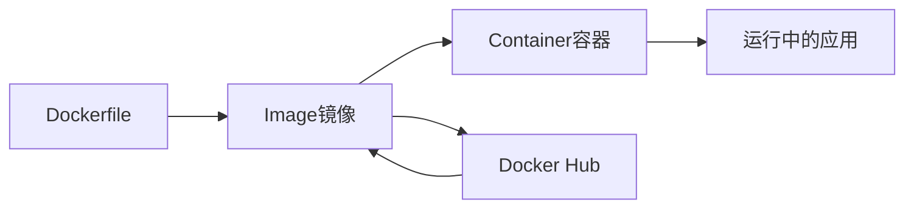

# Docker容器化实战教程

Docker是现代应用部署的标准工具，本教程将带你从零开始掌握Docker。

## Docker基础概念

### 核心概念



### Docker vs 虚拟机

| 特性 | Docker容器 | 虚拟机 |
|------|-----------|--------|
| 启动速度 | 秒级 | 分钟级 |
| 资源占用 | 少 | 多 |
| 隔离性 | 进程级 | 系统级 |
| 性能 | 接近原生 | 有损耗 |

## 安装Docker

### Windows安装

```bash
# 下载Docker Desktop
# https://www.docker.com/products/docker-desktop

# 验证安装
docker --version
docker run hello-world
```

### Linux安装

```bash
# Ubuntu/Debian
curl -fsSL https://get.docker.com -o get-docker.sh
sudo sh get-docker.sh

# 启动Docker服务
sudo systemctl start docker
sudo systemctl enable docker

# 添加用户到docker组
sudo usermod -aG docker $USER
```

## Dockerfile编写

### 基础示例

```dockerfile
# 使用官方Node.js镜像
FROM node:18-alpine

# 设置工作目录
WORKDIR /app

# 复制package文件
COPY package*.json ./

# 安装依赖
RUN npm install --production

# 复制应用代码
COPY . .

# 暴露端口
EXPOSE 3000

# 启动命令
CMD ["node", "server.js"]
```

### 多阶段构建

```dockerfile
# 构建阶段
FROM node:18-alpine AS builder
WORKDIR /app
COPY package*.json ./
RUN npm install
COPY . .
RUN npm run build

# 生产阶段
FROM node:18-alpine
WORKDIR /app
COPY --from=builder /app/dist ./dist
COPY --from=builder /app/node_modules ./node_modules
EXPOSE 3000
CMD ["node", "dist/server.js"]
```

## 常用命令

### 镜像管理

```bash
# 构建镜像
docker build -t myapp:1.0 .

# 查看镜像
docker images

# 删除镜像
docker rmi myapp:1.0

# 推送到仓库
docker push username/myapp:1.0

# 从仓库拉取
docker pull username/myapp:1.0
```

### 容器管理

```bash
# 运行容器
docker run -d -p 3000:3000 --name myapp myapp:1.0

# 查看运行中的容器
docker ps

# 查看所有容器
docker ps -a

# 停止容器
docker stop myapp

# 启动容器
docker start myapp

# 删除容器
docker rm myapp

# 查看日志
docker logs -f myapp

# 进入容器
docker exec -it myapp sh
```

## Docker Compose

### 编写docker-compose.yml

```yaml
version: '3.8'

services:
  web:
    build: .
    ports:
      - "3000:3000"
    environment:
      - NODE_ENV=production
      - DB_HOST=db
    depends_on:
      - db
    volumes:
      - ./logs:/app/logs
    restart: unless-stopped

  db:
    image: postgres:15-alpine
    environment:
      - POSTGRES_DB=myapp
      - POSTGRES_USER=admin
      - POSTGRES_PASSWORD=secret
    volumes:
      - db-data:/var/lib/postgresql/data
    restart: unless-stopped

  redis:
    image: redis:7-alpine
    restart: unless-stopped

volumes:
  db-data:
```

### Compose命令

```bash
# 启动所有服务
docker-compose up -d

# 停止所有服务
docker-compose down

# 查看服务状态
docker-compose ps

# 查看日志
docker-compose logs -f web

# 重启服务
docker-compose restart web

# 构建并启动
docker-compose up -d --build
```

## 最佳实践

### 1. 优化镜像大小

```dockerfile
# ❌ 不好的做法
FROM ubuntu:latest
RUN apt-get update
RUN apt-get install -y nodejs npm
COPY . .

# ✅ 好的做法
FROM node:18-alpine
WORKDIR /app
COPY package*.json ./
RUN npm ci --production
COPY . .
```

### 2. 使用.dockerignore

```
node_modules
npm-debug.log
.git
.env
*.md
.vscode
.idea
dist
coverage
```

### 3. 健康检查

```dockerfile
HEALTHCHECK --interval=30s --timeout=3s --start-period=5s --retries=3 \
  CMD node healthcheck.js
```

### 4. 安全实践

```dockerfile
# 使用非root用户
RUN addgroup -g 1001 -S nodejs
RUN adduser -S nodejs -u 1001
USER nodejs

# 只复制必要文件
COPY --chown=nodejs:nodejs package*.json ./
COPY --chown=nodejs:nodejs . .
```

## 实战案例

### Node.js应用容器化

```dockerfile
FROM node:18-alpine

# 安全：创建非root用户
RUN addgroup -g 1001 -S nodejs && \
    adduser -S nodejs -u 1001

WORKDIR /app

# 优化：先复制依赖文件
COPY --chown=nodejs:nodejs package*.json ./
RUN npm ci --production && npm cache clean --force

# 复制应用代码
COPY --chown=nodejs:nodejs . .

# 切换到非root用户
USER nodejs

EXPOSE 3000

# 健康检查
HEALTHCHECK --interval=30s --timeout=3s \
  CMD node -e "require('http').get('http://localhost:3000/health', (r) => {process.exit(r.statusCode === 200 ? 0 : 1)})"

CMD ["node", "server.js"]
```

## 常见问题

### 容器无法访问

```bash
# 检查端口映射
docker port myapp

# 检查防火墙
sudo ufw status

# 检查容器日志
docker logs myapp
```

### 数据持久化

```bash
# 使用命名卷
docker volume create mydata
docker run -v mydata:/app/data myapp

# 使用绑定挂载
docker run -v $(pwd)/data:/app/data myapp
```

> **提示**: Docker是容器化的基础，掌握它将大大提升你的开发和部署效率！
